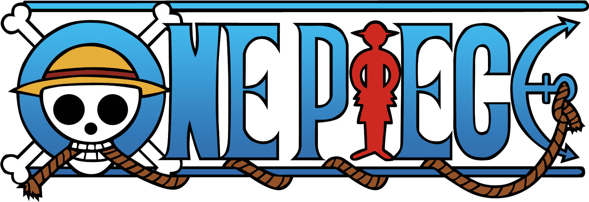
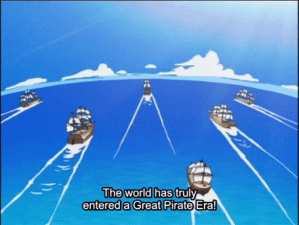
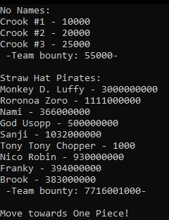
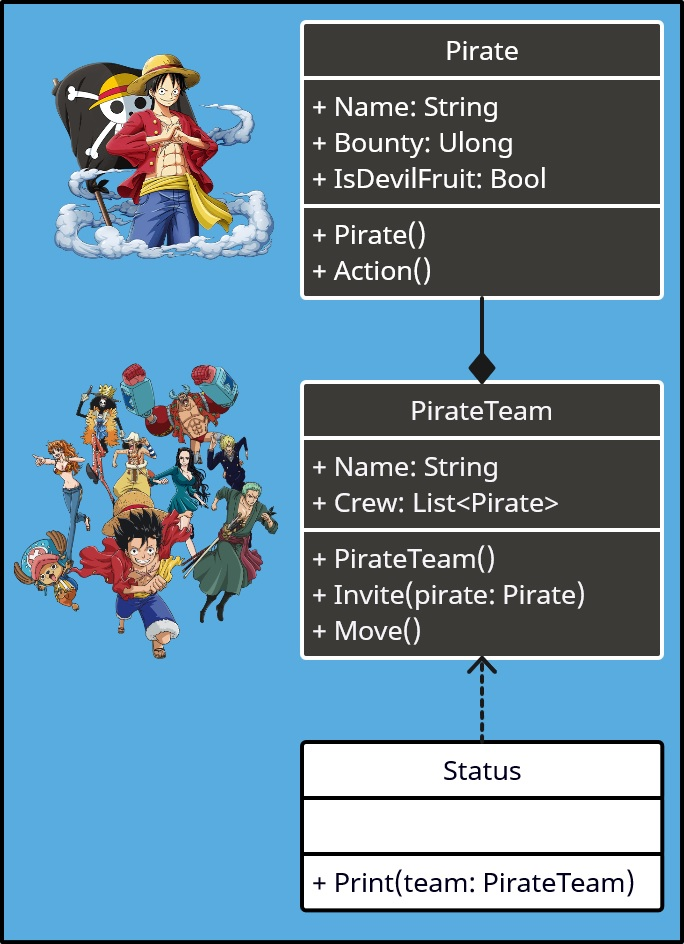
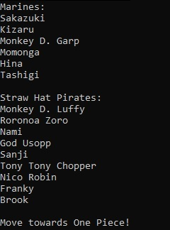
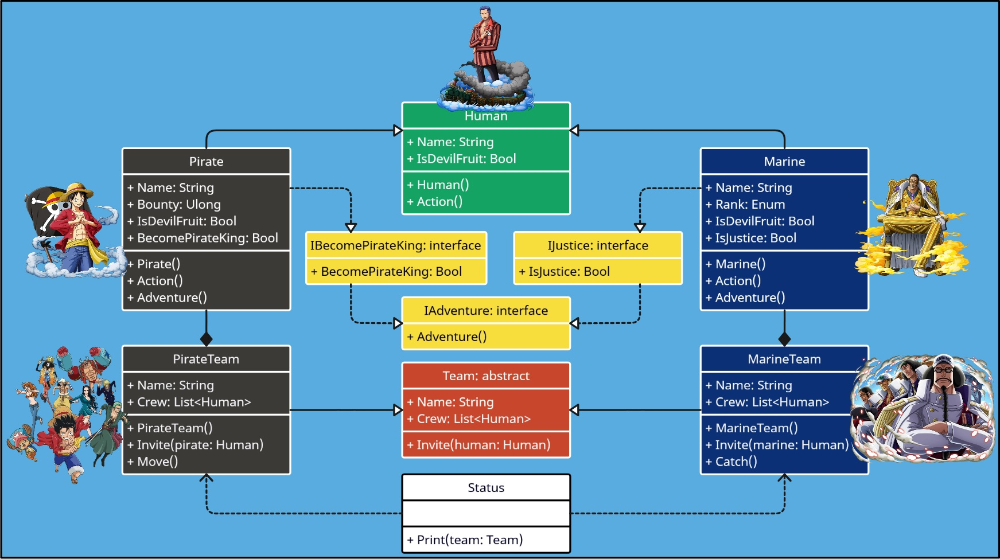
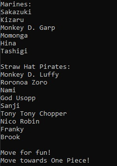
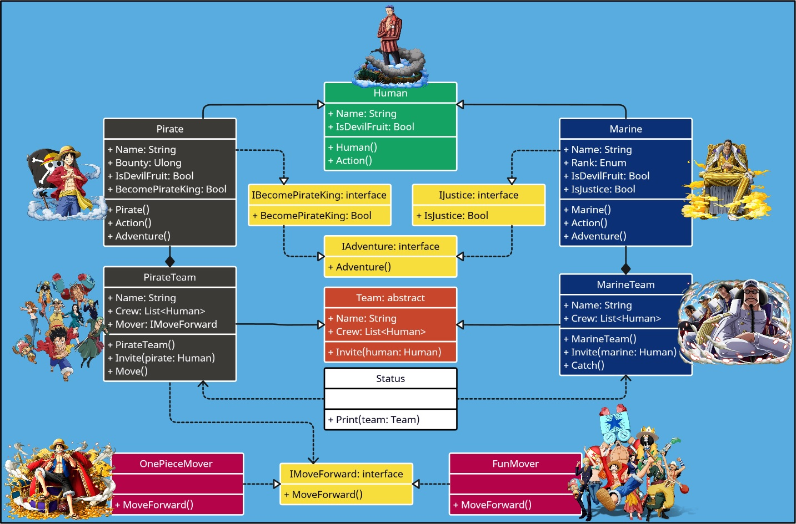
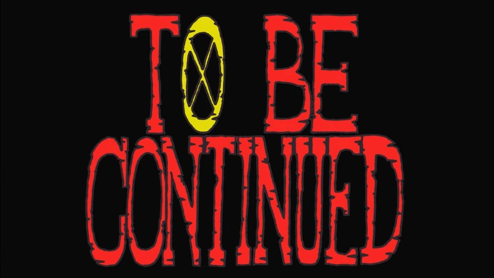

<div id="header" align="center">
  
</div>

<h1 align="center"> Применим принципы SOLID чтобы открыть <br/>⚓ Великую Эру Пиратов! ⚓</h1>
<p align="center">
  
</p>

<h2 align="center">🌊 SRP 🌊</h2>

&nbsp;&nbsp;&nbsp;&nbsp;
Вначале опишим класс `Pirate` и создадим пиратскую команду `PirateTeam` которая совершает пиратские дела, а операцию вывода статистической информации
согласно **Принципу единственной обязанности** вынесем в отдельный класс `Status`:<br/>
 
 

```csharp
    public class Pirate(string name, ulong bounty, bool isDevilFruit = false)
    {
        public string Name { get; } = name;
        public ulong Bounty { get; set; } = bounty;
        public bool IsDevilFruit { get; set; } = isDevilFruit;

        public void Action()
        {
            Console.WriteLine("Pirate Action!");
        }
    }

    public class PirateTeam(string name)
    {
        public string Name { get; } = name;
        public List<Pirate> Crew { get; } = [];

        public void Invite(Pirate pirate)
        {
            Crew.Add(pirate);
        }

        public void Move()
        {
            Console.WriteLine("Move towards One Piece!");
        }
    }

    public class Status
    {
        public void Print(PirateTeam team)
        {
            Console.WriteLine($"{team.Name}:");

            ulong bounty = 0L;

            foreach (var pirate in team.Crew)
            {
                Console.Write($"{pirate.Name}");
                Console.WriteLine($" - {pirate.Bounty}");
                bounty += pirate.Bounty;
            }
            Console.WriteLine($" -Team bounty: {bounty}- ");
            Console.WriteLine("");
        }
    }
```

<details><summary>Результат работы</summary>  
 

```csharp
    public class MainClass
    {
        public static void Main(string[] args)
        {
            PirateTeam noNames = new("No Names");
            noNames.Invite(new Pirate("Crook #1", 10000L));
            noNames.Invite(new Pirate("Crook #2", 20000L));
            noNames.Invite(new Pirate("Crook #3", 25000L));

            PirateTeam strawHats = new("Straw Hat Pirates");
            strawHats.Invite(new Pirate("Monkey D. Luffy", 3000000000L, true));
            strawHats.Invite(new Pirate("Roronoa Zoro", 1111000000L));
            strawHats.Invite(new Pirate("Nami", 366000000L));
            strawHats.Invite(new Pirate("God Usopp", 500000000L));
            strawHats.Invite(new Pirate("Sanji", 1032000000L));
            strawHats.Invite(new Pirate("Tony Tony Chopper", 1000L, true));
            strawHats.Invite(new Pirate("Nico Robin", 930000000L, true));
            strawHats.Invite(new Pirate("Franky", 394000000L));
            strawHats.Invite(new Pirate("Brook", 383000000L, true));

            Status status = new();
            status.Print(noNames);
            status.Print(strawHats);

            strawHats.Move();
        }
    }
```
</details>

&nbsp;&nbsp;&nbsp;&nbsp;
UML-схема классов выглядит следующим образом:
<p align="center">
  
</p>

📘 [<i>Принцип единственной обязанности (Single Responsibility Principle)</i>](https://metanit.com/sharp/patterns/5.1.php)

<h2 align="center">🌊 OCP 🌊</h2>

&nbsp;&nbsp;&nbsp;&nbsp;
В мире One Piece живут не только пираты, да и пиратом не рождаются, а становятся. Поэтому согласно **Принципу открытости/закрытости** опишим класс `Human`,
воспользуемся паттерном Шаблонный метод для описания архитектуры команд `Team` и зададим представителей морского дозора в `Marine` и `MarineTeam`:<br/>

 

```csharp
    public class Human(string name, bool isDevilFruit = false)
    {
        public string Name { get; protected set; } = name;
        public bool IsDevilFruit { get; set; } = isDevilFruit;

        public virtual void Action()
        {
            Console.WriteLine("Human Action!");
        }
    }

    public class Pirate(string name, ulong bounty, bool isDevilFruit = false) 
        : Human(name, isDevilFruit)
    {
        public ulong Bounty { get; set; } = bounty;

        public override void Action()
        {
            Console.WriteLine("Pirate Action!");
        }
    }

    public class Marine(string name, Personnel rank, bool isDevilFruit = false) 
        : Human(name, isDevilFruit)
    {
        public Personnel Rank { get; set; } = rank;

        public override void Action()
        {
            Console.WriteLine("Marine Action!");
        }
    }

    public enum Personnel : byte
    {
        FleetAdmiral,
        Admiral,
        ViceAdmiral,
        RearAdmiral,
        Captain
    }

    public abstract class Team
    {
        [NotNull]
        public string? Name { get; protected set; }
        [NotNull]
        public List<Human>? Сrew { get; protected set; }

        public abstract void Invite(Human human);
    }

    public class PirateTeam : Team
    {
        public PirateTeam(string name)
        {
            Name = name;
            Сrew = [];
        }

        public override void Invite(Human pirate)
        {
            Сrew.Add(pirate);
        }

        public void Move()
        {
            Console.WriteLine("Move towards One Piece!");
        }
    }

    public class MarineTeam : Team
    {
        public MarineTeam(string name)
        {
            Name = name;
            Сrew = [];
        }

        public override void Invite(Human marine)
        {
            Сrew.Add(marine);
        }

        public void Catch()
        {
            Console.WriteLine("Catch the pirates!");
        }
    }
```

<details><summary>Результат работы</summary>  
 

```csharp
    public class MainClass
    {
        public static void Main(string[] args)
        {
            MarineTeam marines = new("Marines");
            marines.Invite(new Marine("Sakazuki", Personnel.FleetAdmiral, true));
            marines.Invite(new Marine("Kizaru", Personnel.Admiral, true));
            marines.Invite(new Marine("Monkey D. Garp", Personnel.ViceAdmiral));
            marines.Invite(new Marine("Momonga", Personnel.ViceAdmiral));
            marines.Invite(new Marine("Hina", Personnel.RearAdmiral));
            marines.Invite(new Marine("Tashigi", Personnel.Captain));

            PirateTeam strawHats = new("Straw Hat Pirates");
            strawHats.Invite(new Pirate("Monkey D. Luffy", 3000000000L, true));
            strawHats.Invite(new Pirate("Roronoa Zoro", 1111000000L));
            strawHats.Invite(new Pirate("Nami", 366000000L));
            strawHats.Invite(new Pirate("God Usopp", 500000000L));
            strawHats.Invite(new Pirate("Sanji", 1032000000L));
            strawHats.Invite(new Pirate("Tony Tony Chopper", 1000L, true));
            strawHats.Invite(new Pirate("Nico Robin", 930000000L, true));
            strawHats.Invite(new Pirate("Franky", 394000000L));
            strawHats.Invite(new Pirate("Brook", 383000000L, true));

            Status status = new();
            status.Print(marines);
            status.Print(strawHats);

            strawHats.Move();
        }
    }
```
</details>

&nbsp;&nbsp;&nbsp;&nbsp;
UML-схема классов выглядит следующим образом:
<p align="center">
  
</p>

📕 [<i>Принцип открытости/закрытости (Open/Closed Principle)</i>](https://metanit.com/sharp/patterns/5.2.php)

<h2 align="center">🌊 LSP 🌊</h2>

&nbsp;&nbsp;&nbsp;&nbsp;
Независимо от того, кем ты станешь, у тебя должно быть имя. Поэтому согласно **Принципу подстановки Лисков** добавим проверки не нарушая инварианты:<br/>

 

```csharp
    public class Human
    {
        public string Name { get; protected set; }
        public bool IsDevilFruit { get; set; }

        public Human(string name, bool isDevilFruit = false)
        {
            if (name.Length < 1)
            {
                throw new Exception("Human must have a name!");
            }
            Name = name;
            IsDevilFruit = isDevilFruit;
        }

        public virtual void Action()
        {
            Console.WriteLine("Human Action!");
        }
    }

    public class Pirate : Human
    {
        public ulong Bounty { get; set; }

        public Pirate(string name, ulong bounty, bool isDevilFruit = false) 
            : base(name, isDevilFruit)
        {
            if (name.Length < 1)
            {
                throw new Exception("Pirate must have a name!");
            }
            Bounty = bounty;
        }

        public override void Action()
        {
            Console.WriteLine("Pirate Action!");
        }
    }

    public class Marine : Human
    {
        public Personnel Rank { get; set; }

        public Marine(string name, Personnel rank, bool isDevilFruit = false) 
            : base(name, isDevilFruit)
        {
            if (name.Length < 1)
            {
                throw new Exception("Marine must have a name!");
            }
            Rank = rank;
        }

        public override void Action()
        {
            Console.WriteLine("Marine Action!");
        }
    }

    public enum Personnel : byte
    {
        FleetAdmiral,
        Admiral,
        ViceAdmiral,
        RearAdmiral,
        Captain
    }
```

&nbsp;&nbsp;&nbsp;&nbsp;
UML-схема классов останется прежней.

📔 [<i>Принцип подстановки Лисков (Liskov Substitution Principle)</i>](https://metanit.com/sharp/patterns/5.3.php)

<h2 align="center">🌊 ISP 🌊</h2>

&nbsp;&nbsp;&nbsp;&nbsp;
Каждый, кто отправился в море, начинает своё собственное приключение и ставит перед собой определённую цель. Приключение может быть одно, а вот цели
могут отличаться. Благодаря **Принципу разделения интерфейсов** покажем это через интерфейсы `IAdventure`, `IJustice` и `IBecomePirateKing`:<br/>

 

```csharp
    public interface IAdventure
    {
        public void Adventure();
    }

    public interface IJustice : IAdventure
    {
        public bool IsJustice { get; set; }
    }

    public interface IBecomePirateKing : IAdventure
    {
        public bool BecomePirateKing { get; set; }
    }
```
<br/><br/><br/><br/><br/><br/>
&nbsp;&nbsp;&nbsp;&nbsp;
UML-схема классов выглядит следующим образом:
<p align="center">
  
</p>

📙 [<i>Принцип разделения интерфейсов (Interface Segregation Principle)</i>](https://metanit.com/sharp/patterns/5.4.php)

<h2 align="center">🌊 DIP 🌊</h2>

&nbsp;&nbsp;&nbsp;&nbsp;
Будни пиратов - процесс не рутинный. Покажем это с помощью **Принципа инверсии зависимостей**, интерфейса `IMoveForward`, классов 
`OnePieceMover` и `FunMover`:<br/>

 

```csharp
    public interface IMoveForward
    {
        public void MoveForward();
    }

    public class OnePieceMover : IMoveForward
    {
        public void MoveForward()
        {
            Console.WriteLine("Move towards One Piece!");
        }
    }

    public class FunMover : IMoveForward
    {
        public void MoveForward()
        {
            Console.WriteLine("Move for fun!");
        }
    }
```
<br/>
<details><summary>Результат работы</summary>  
 

```csharp
    public class MainClass
    {
        public static void Main(string[] args)
        {
            MarineTeam marines = new("Marines");
            marines.Invite(new Marine("Sakazuki", Personnel.FleetAdmiral, true));
            marines.Invite(new Marine("Kizaru", Personnel.Admiral, true));
            marines.Invite(new Marine("Monkey D. Garp", Personnel.ViceAdmiral));
            marines.Invite(new Marine("Momonga", Personnel.ViceAdmiral));
            marines.Invite(new Marine("Hina", Personnel.RearAdmiral));
            marines.Invite(new Marine("Tashigi", Personnel.Captain));

            PirateTeam strawHats = new("Straw Hat Pirates", new FunMover());
            strawHats.Invite(new Pirate("Monkey D. Luffy", 3000000000L, true));
            strawHats.Invite(new Pirate("Roronoa Zoro", 1111000000L));
            strawHats.Invite(new Pirate("Nami", 366000000L));
            strawHats.Invite(new Pirate("God Usopp", 500000000L));
            strawHats.Invite(new Pirate("Sanji", 1032000000L));
            strawHats.Invite(new Pirate("Tony Tony Chopper", 1000L, true));
            strawHats.Invite(new Pirate("Nico Robin", 930000000L, true));
            strawHats.Invite(new Pirate("Franky", 394000000L));
            strawHats.Invite(new Pirate("Brook", 383000000L, true));

            Status status = new();
            status.Print(marines);
            status.Print(strawHats);

            strawHats.Move();
            strawHats.Mover = new OnePieceMover();
            strawHats.Move();
        }
    }
```
</details>

&nbsp;&nbsp;&nbsp;&nbsp;
UML-схема классов выглядит следующим образом:
<p align="center">
  
</p>

📗 [<i>Принцип инверсии зависимостей (Dependency Inversion Principle)</i>](https://metanit.com/sharp/patterns/5.5.php)
<hr/>

&nbsp;&nbsp;&nbsp;&nbsp;
Финальный результат [<i>"Одним Куском"</i>](doc/code.md)

<p align="center">
  
</p>
